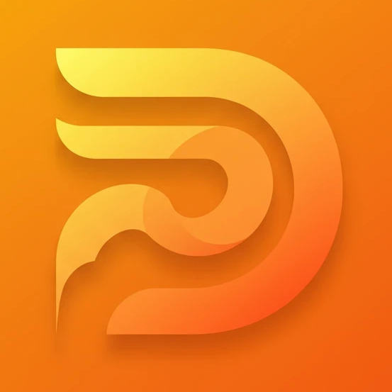

# 🦆 DuckBlock


**DuckBlock** ist eine schlanke, effiziente und leichtgewichtige Browser-Erweiterung für alle Chromium-basierten Browser (z. B. Chrome, Edge, Brave), die die Suche mit [DuckDuckGo](https://duckduckgo.com) fokussierter und ablenkungsfreier gestaltet.

## 🎯 Ziel

DuckBlock wurde entwickelt, um während der Recherche auf DuckDuckGo fokussiert zu bleiben. Die Erweiterung entfernt automatisch visuelle und inhaltliche Ablenkungen wie:

- News-Boxen
- "Ähnliche Suchanfragen"
- Sidebar-Inhalte
- Icons, Bilder, zusätzliche Ergebnisselemente

Damit kannst du dich ganz auf das konzentrieren, was wirklich zählt: **die Suchergebnisse selbst.**

---

## ✨ Features

- Entfernt automatisch:
  - DuckDuckGo-News-Sektion
  - "Mehr anzeigen"-Buttons
  - Verwandte Suchen
  - Sidebar-Module und Feedback-Prompts
- Funktioniert komplett im Hintergrund
- Keine Konfiguration notwendig
- Keine Drittanbieter-Trackings oder Datenweitergabe
- Open Source & transparent

---

## 🛠️ Installation

### 🧪 Manuelle Installation (für Entwickler oder Testzwecke)

1. Repository klonen oder ZIP herunterladen:

   ```bash
   git clone https://github.com/dein-benutzername/duckblock.git
   ```

2. Öffne deinen Chromium-basierten Browser.
3. Gehe zu: `chrome://extensions/`
4. Aktiviere den **Entwicklermodus** (oben rechts).
5. Klicke auf **"Entpackte Erweiterung laden"** und wähle den Ordner `duckblock` aus.
6. Fertig! DuckBlock ist nun aktiv.

---

## 📷 Screenshots

_(Optional – hier kannst du ein Vorher/Nachher Bild der DuckDuckGo-Suchergebnisse einfügen)_

---

## 🔒 Datenschutz

DuckBlock speichert, verarbeitet oder überträgt **keinerlei** persönliche Daten. Die Erweiterung arbeitet vollständig lokal im Browser und benötigt keine besonderen Berechtigungen außer dem Zugriff auf duckduckgo.com.

---

## 🚧 Roadmap / Geplante Features

- Einstellbare Filteroptionen (z. B. nur News oder nur Sidebar entfernen)
- Unterstützung für mobile DuckDuckGo-Ansichten
- Temporäre Deaktivierung via Icon-Klick

---

## 📄 Lizenz

Dieses Projekt steht unter der **MIT-Lizenz**. Weitere Informationen findest du in der Datei [`LICENSE`](./LICENSE).

---

## 🤝 Mitwirken

Pull Requests, Feedback oder Verbesserungsvorschläge sind herzlich willkommen! Erstelle gerne ein Issue oder forke das Projekt und bring deine Ideen ein.

---

## 📬 Kontakt

Bei Fragen oder Anregungen:
[Dein Name oder Pseudonym] – [Optional: E-Mail oder GitHub-Profil]

---

**Bleib fokussiert. Such effizient. Mit DuckBlock.**
